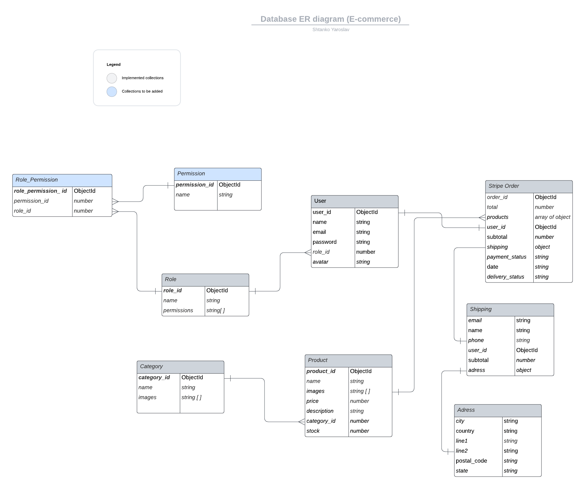

# Backend Assignment - REST API

Within this assignment the REST API for an e-commerce website is implemented according to the Entity-Relationship Diagram outlining the data model including the relationships and attributes of collections within the system.

## Contents

- [Technologies](#technologies)
- [Getting Started](#getting-started)
- [ER Diagram](#er-diagram)
- [Project Features](#project-features)
- [Project Structure](#project-structure)
- [Testing](#testing)

## Technologies


## Getting started

- Clone the project `git clone https://github.com/Yaroslav1918/Ecommerce-API`;
- Create your `.env` file using `.env.example` file as an exaple and fill it with your credentials;
- Use `npm install` to install all dependencies and necessary packages;
- Run the server using `npm run start`.

## ER Diagram

Within the project, the following entities are covered: users, products, categories, roles, payments.


## Project Features

### Entity CRUD Operations

Based on the specifications provided in the ERD assignment the basic CRUD (Create, Read, Update, Delete) operations for the entities are implemented.

### Authentication and authorization

For security resons, certain endpoint are protected with the following middleware:
- authWithGoogle: verifying  user via google token
- checkAuth: verifying is a user is logged in. There are two ways of authentication implemented: using JWT and brokered authentication with Google;
- checkRole: verifying if a user is a customer or and admin;
- checkPermissions: verifying if an admin has a particular access

### Payment
This project includes a Stripe test payment system. For testing payments, the test card is 4242 4242 4242 4242.

### Env
This project includes the following env variables:
1. DB_URL_COMMON - Mongo Db cluster url 
2. TOKEN_SECRET - It's a secret key used to sign and verify tokens, ensuring their authenticity and integrity
3. GOOGLE_CLIENT_ID - This is a unique identifier assigned to your application when you register it with the Google API Console 
4. STRIPE_KEY - This is a unique identifier assigned to your application when you register it with Stripe
5. CLIENT_URL = front end url


### Main routes
baseUrl"/products"
baseUrl"/categories"
baseUrl"/users"
baseUrl"/payments"
baseUrl"/roles"

### Response Format
All API responses are provided in JSON format which includes a `status`, `data`, and an optional `message` field.

### Error Handling
To handle API errors, the apiErrorHandler, routeNotFound are implemented.

### Validation
1. The `emailChecker` checks if the user's email is unique.
2. The `validate` middleware uses a Zod schema to ensure that products, categories, and users are valid.

### Additional information
Log in as a admin; credentials:
mail: te2423@gmail.com
password: 12345

## Project Structure
Below is the high-level project folder structure represented.

```
 .
 ├── server
 |  ├── controllers
 |  ├── middlewares
 |  ├── models
 |  ├── routes
 |  ├── schemas
 |  ├── services
 |  ├── test
 |  ├── types
 |  ├── utils
 |  ├── app.ts
 |  ├── server.ts
 ├── .env.example
 ├── .gitignore
 ├── package.json
 ├── Database-ER-diagram.png
 ├── README.md
 ├── jest.config.ts
 └── tsconfig.json
```

## Testing

The test cases for all the key Services and Controllers have been built with Jest testing library. In this porject, unit testing and integration testing approaches were used. The test requests are sent to the built mock server, not the real API.

Run `npm run test` to implement all the tests.

# Back-end Project
[Project Link](https://ecommerce-api-3946fddfdbf1.herokuapp.com/)